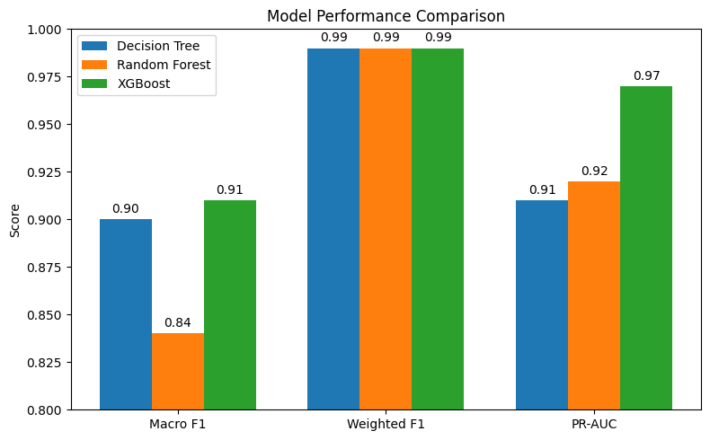

# Suricata IDS with Machine Learning

A smart network intrusion detection system using **Suricata** and **machine learning** for real-time threat detection.

---

## 📌 Overview
This project implements **SNIDS (Smart Network Intrusion Detection System)** – a hybrid IDS that combines **signature-based detection (Suricata)** with **supervised machine learning models** for anomaly classification.

Traditional IDS solutions such as Snort or Suricata rules can detect known threats effectively but often fail against **unknown or zero-day attacks**. Our system addresses this limitation by integrating **ML-based anomaly detection** into Suricata’s pipeline, enabling both **known and unknown attack detection**.  
It is designed for deployment in enterprise or local networks to protect critical assets from external attackers in real time.

---

## 🚀 Features
- **Hybrid Detection**: Combines Suricata’s signature-based engine with ML-based anomaly detection.  
- **Machine Learning Models**: Implements **Decision Trees, Random Forest, and XGBoost** trained on the **CIC-IDS2017 dataset**.  
- **Real-time Monitoring**: Suricata logs network traffic flows, which are classified by ML models as benign or malicious.  
- **Automated Response**: Malicious IPs are dynamically added to a **blacklist**, and Suricata rules automatically block them.  
- **Extensible Architecture**: Modular design allows easy integration of new datasets, models, or rules.  

---

## 🛠️ System Architecture
The system simulates a local network consisting of three layers:

1. **Internal Network (192.168.50.0/24)** – critical assets such as web servers and databases.  
2. **Attacker Network (10.81.50.0/24)** – attacker machine with tools like nmap, Hydra, and hping3.  
3. **NAT Network** – bridge to the Internet, exposing typical attack surfaces.  

**Suricata** is deployed between the attacker and the internal network to capture traffic. Flow features are exported to ML models, which classify them as benign or malicious. If malicious, the attacker IP is added to a blacklist, and Suricata blocks future traffic from it.

---

## 📊 Machine Learning
- **Dataset**: CIC-IDS2017 (~2.83M rows, 79 features, multiple attack types).  
- **Models Used**:  
  - Decision Trees  
  - Random Forest  
  - XGBoost (best performing)  
- **Preprocessing**: Feature cleaning, class balancing (SMOTE, oversampling rare attacks), normalization.  
- **Evaluation Metrics**: Macro F1, Weighted F1, PR-AUC, Confusion Matrix, F1 per class.  

### Results
 

---

## ⚔️ Attack Scenarios Tested
The system was validated with real attack simulations:

1. **DDoS (ICMP Flood)** – attacker IP detected and blocked in real time.  
2. **Brute Force (Hydra on web login)** – classified correctly and attacker IP blocked.  
3. **Port Scanning (nmap full TCP scan)** – detected abnormal scan behavior and blocked attacker IP.  

---

## 🔮 Future Work
- Integrate **provenance graph analysis** to detect **Advanced Persistent Threats (APTs)**.  
- Implement **self-learning IDS** with online or reinforcement learning.  
- Improve feature engineering to **reduce false positives** and enhance performance.  

---

## 👨‍💻 Authors
- Đặng Đức Tài 
- Trần Văn Chiến  
- Nguyễn Đặng Quỳnh Như  
- Lê Minh Quân  

**Information Security Laboratory, University of Information Technology – VNU HCMC**
